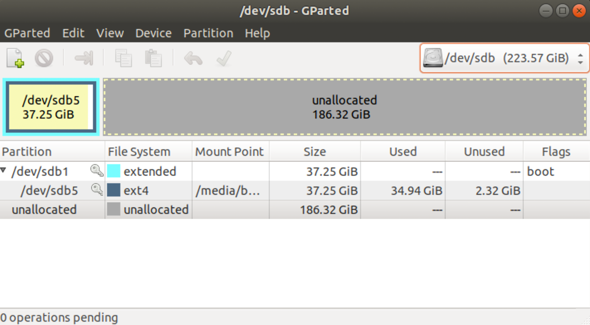
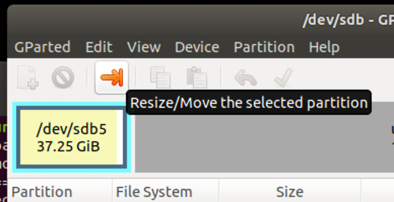
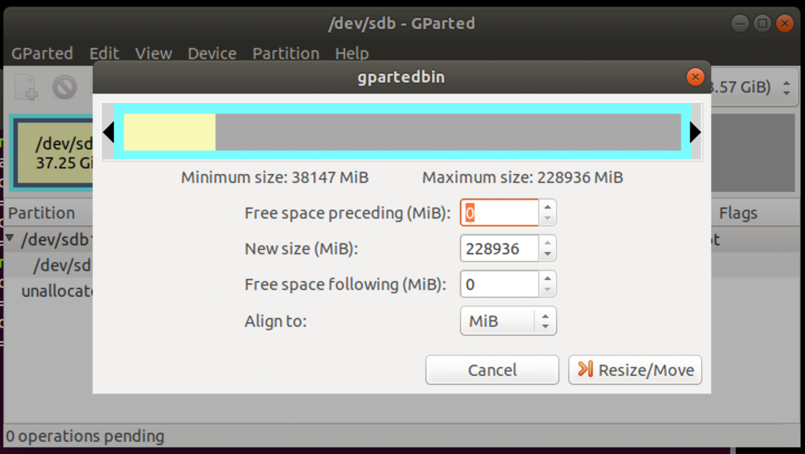
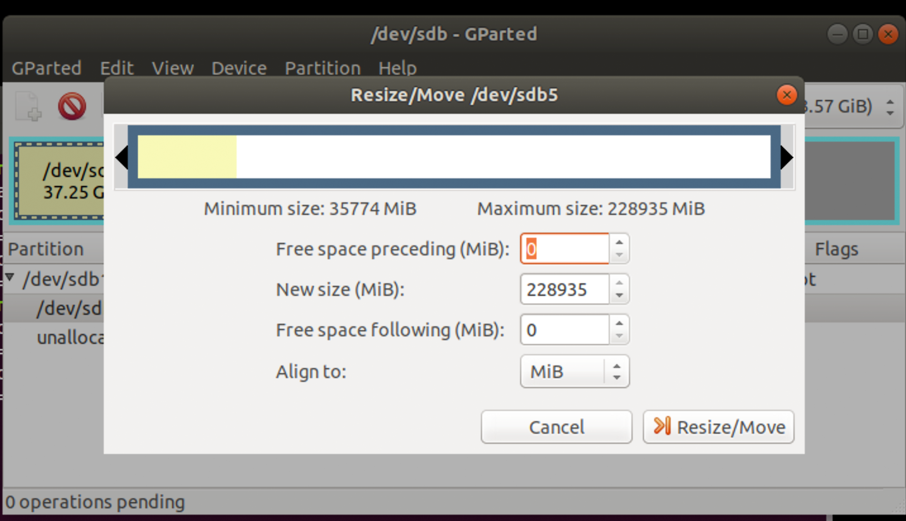
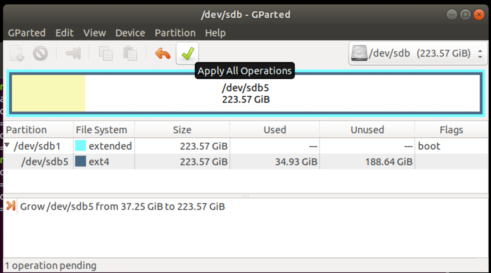

# Aumentar a partição do Linux

O SSD que foi fornecido tem muito espaço ainda  não alocado.  Este guia ajuda a redimensionar o volume Linux (partição `/`) para aproveitar melhor todo o disco.

**Importante: Você vai precisar plugar seu disco em um outro Linux para conseguir redimensioná-lo**

## Passo 1

Plugue o SSD em algum Linux já inicializado.

## Passo 2

Rode o comando a seguir:

    sudo gparted

Localize qual é o seu disco na aba superior direita. Você deve visualizar a instalação Linux ocupando uma fração pequena e todo o resto vazio, em cinza, como na figura a seguir

**Atenção:** As imagens mostrarão um SSD de 240GB mas seu disco pode ter outro tamanho.

## Passo 3

Clique na partição com o botão direito e selecione a opção *Unmount*

Essa opção torna a partição indisponível para uso por parte dos programas.

## Passo 4

Clique no volume (borda ciano claro) e a seguir selecione a opção *Resize/Move*

## Passo 5

Arraste a seta da direita até ficar com o tamanho que gostaria. A seguir clique no botão *Resize/Move* da caixa de diálogo

Note a borda ciano. Significa que estamos aumentando *o volume lógico*

## Passo 6

Após o redimensionamento do volume ter concluído, selecione **agora a partição** que tem a borda em azul mais escuro.

Arraste-a para redimensionar.

## Passo 7

Clique no símbolo de $\Checkmark$ em verde

## Passo 8

Confirme clicando em *Apply* e aguarde o término da operação.

## Passo 9

Remova o disco e tente fazer o *boot* em seu computador

